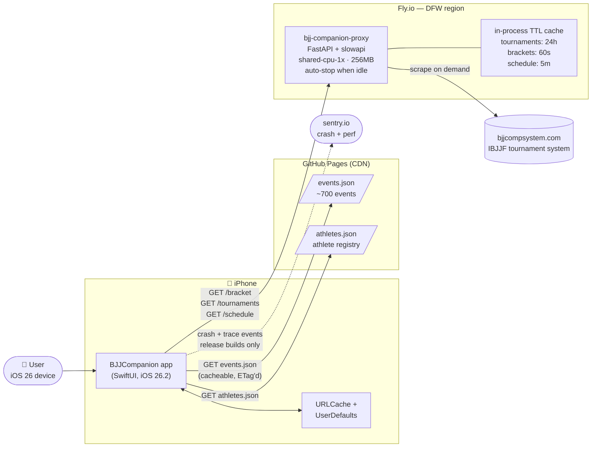
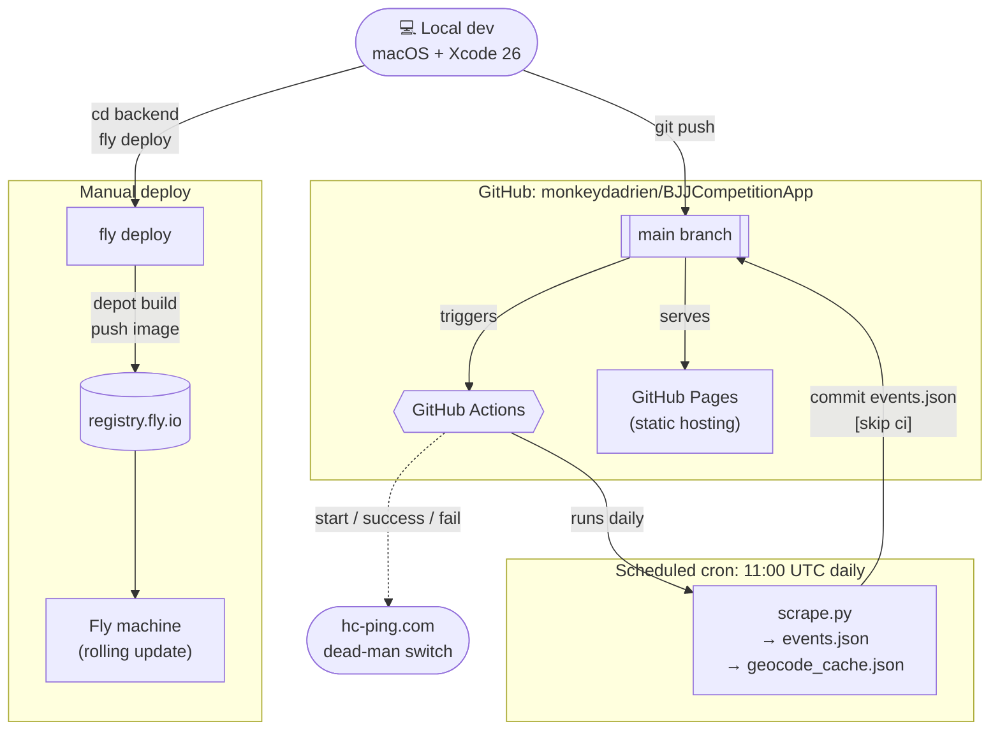
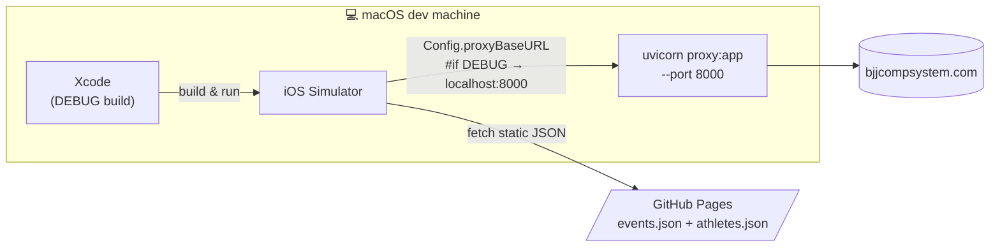
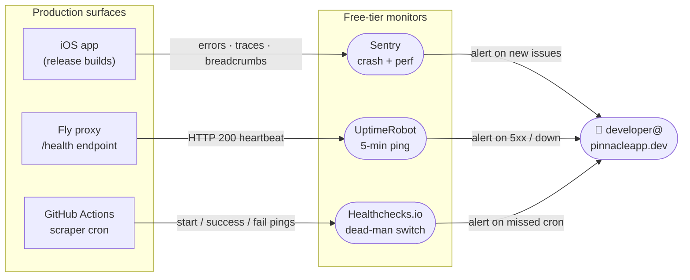
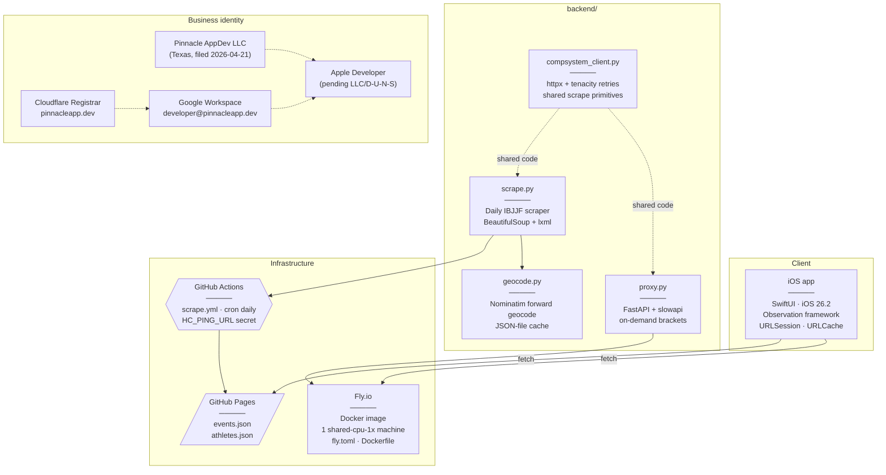

# BJJ Companion — Architecture

A single-developer iOS app backed by a scraping pipeline and a thin on-demand
proxy. All infrastructure is free-tier. Nothing stateful runs in production
except the ephemeral Fly proxy — events and athletes are served as static JSON
refreshed daily by CI.

---

## 1. Runtime data flow

How a user launching the app gets fresh data on their screen.

**Key design choices:**

- **Static JSON for bulk data.** Events and athletes change daily at most, so
  serving them as flat files via GitHub Pages is free, infinitely scalable, and
  has zero operational burden. No database needed.
- **Proxy only for the live path.** Brackets update minute-by-minute during
  tournaments, so they can't be pre-baked. Fly proxy hits IBJJF on demand with
  short TTL caching to protect the upstream.
- **Scale-to-zero.** Fly machine stops when idle. UptimeRobot's 5-min health
  ping keeps one warm during active hours; cold starts are ~2s otherwise.

---

## 2. Build & deploy pipeline

What happens when code changes land on `main`.

**Two separate deploy tracks:**

| Track | Trigger | Cadence | Output |
|---|---|---|---|
| **iOS app** | manual Xcode archive → TestFlight/App Store | per release | `.ipa` to Apple |
| **Data refresh** | GitHub Actions cron | daily 11:00 UTC | `events.json` committed + served via Pages |
| **Proxy** | `fly deploy` from local | on demand | new container on Fly DFW |

The scraper committing to `main` uses `[skip ci]` to avoid infinite loops.

---

## 3. Dev loop

What running the app locally looks like.

- `Config.swift` swaps `proxyBaseURL` between `localhost:8000` (DEBUG) and
  `bjj-companion-proxy.fly.dev` (release). No runtime env vars needed.
- Sentry is `#if canImport(Sentry) && !DEBUG` — debug builds never send events,
  so noisy dev sessions don't pollute the error feed.

---

## 4. Observability

**Coverage map:**

| What breaks | Who tells you |
|---|---|
| iOS app crashes / handled errors | Sentry |
| Proxy down or unhealthy | UptimeRobot |
| Daily scrape stops running or fails | Healthchecks.io |
| IBJJF changes HTML structure | Healthchecks (fail ping from scraper exception) |
| Fly machine OOM / deploy failure | Fly dashboard + UptimeRobot |

All three monitors email `developer@pinnacleapp.dev`. No SMS or paging.

---

## 5. Component inventory

---

## 6. Costs

Everything in production runs on free tiers. Per month:

| Service | Free tier | Current usage | Estimated cap |
|---|---|---|---|
| GitHub Pages | unlimited bandwidth for public repo | ~700 events JSON | ≤1 GB/mo |
| GitHub Actions | 2,000 min/mo private (unlimited public) | ~2 min/day = 60 min/mo | ≤3% of cap |
| Fly.io | $5/mo credit, scale-to-zero | 1 machine · ~0 active hrs/day | $0 realized |
| Sentry | 5K errors + 10K perf events | 0 (new) | well inside |
| UptimeRobot | 50 monitors @ 5-min | 1 | 2% of cap |
| Healthchecks.io | 20 checks free | 1 | 5% of cap |
| Cloudflare Registrar | domain at wholesale cost | `pinnacleapp.dev` | ~$12/yr |
| Google Workspace | paid ($6/user/mo) | 1 user | $72/yr |

**Realized cost today:** ~$84/yr (Workspace + domain). Apple Developer Program
adds $99/yr once Org enrollment completes.

---

## 7. Stack summary

**iOS:** Swift · SwiftUI · iOS 26.2 minimum · Xcode 26 · Observation framework · URLSession · Sentry SDK

**Backend (Python 3.12):** FastAPI · uvicorn · httpx · BeautifulSoup4 · lxml · pydantic · tenacity · slowapi · Nominatim

**Infrastructure:** GitHub (repo + Pages + Actions) · Fly.io (Docker container) · Cloudflare Registrar · Google Workspace

**Observability:** Sentry · UptimeRobot · Healthchecks.io

**Business:** Pinnacle AppDev LLC (Texas) · `pinnacleapp.dev` · bundle ID `dev.pinnacleapp.bjjcompanion`
